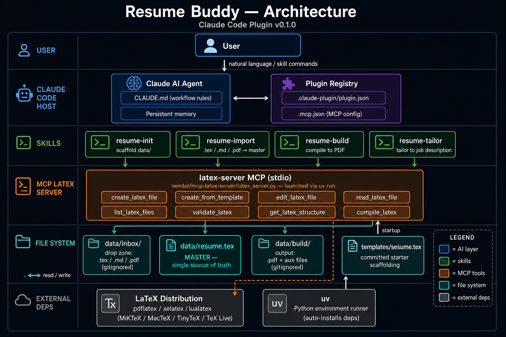

# Resume Buddy

An AI-powered LaTeX resume workshop, packaged as a **Claude Code plugin**. Resume
Buddy bundles a local [MCP LaTeX Server](https://github.com/RobertoDure/mcp-latex-server)
so the AI can create, edit, validate, and compile your resume as a real `.tex`
file — plus skills that drive the whole workflow.

The intended workflow is conversational: bring your resume (or start from a
template), then tell the AI what you want ("add my new job at Acme", "tighten the
summary", "tailor this for a senior backend role"), and it edits the LaTeX and
produces an updated PDF.



---

## How it works

- **Master = `data/resume.tex`** — the single source of truth the AI edits.
- **`data/inbox/`** — drop your existing resume here (`.tex`, `.md`, or `.pdf`).
- **`data/build/`** — compiled PDFs and LaTeX aux files (disposable).
- **`data/` is gitignored** — your personal details never land in version control.
- **`.tex` is the happy path.** No LaTeX yet? Bring a `.md`/`.pdf` and the AI fills
  the committed `templates/resume.tex` starter for you.

### Skills

| Skill | What it does |
|---|---|
| `/resume-init` | Scaffold `data/` and seed a starter resume for a new user |
| `/resume-import` | Bring in an existing resume (`.tex` directly, or fill the template from `.md`/`.pdf`); re-imports merge into the master |
| `/resume-build` | Compile the master to a PDF in `data/build/` |
| `/resume-tailor` | Tailor the resume (or a variant) to a pasted job description |

---

## Prerequisites

| Tool | Purpose | Install |
|---|---|---|
| [Claude Code](https://code.claude.com/) | AI front-end + plugin host | See link |
| [uv](https://docs.astral.sh/uv/) | Runs the Python MCP server | `scripts/setup` installs it, or one line (below) |
| A LaTeX engine | Compiles `.tex` → PDF | TinyTeX recommended (below) |

### LaTeX engine

The one piece you install by hand is a LaTeX engine that provides `pdflatex` —
that's what the bundled server calls to make PDFs. We recommend
**[TinyTeX](https://yihui.org/tinytex/)**: a lightweight (~150 MB), cross-platform
LaTeX distribution that installs **without admin rights** and fetches extra
packages on demand.

- **macOS / Linux**
  ```
  curl -sL "https://yihui.org/tinytex/install-bin-unix.sh" | sh
  ```
- **Windows** (PowerShell, no admin)
  ```
  Invoke-WebRequest https://yihui.org/tinytex/install-bin-windows.bat -OutFile install-tinytex.bat; ./install-tinytex.bat
  ```

Restart your shell, then verify it's on your `PATH`: `pdflatex --version`.

If a compile reports a missing package, install it with `tlmgr install <package>`
(TinyTeX bundles `tlmgr`). Already have **MiKTeX**, **MacTeX**, or **TeX Live**?
Those work too — any distribution that puts `pdflatex` on your `PATH` is fine.

### uv

`scripts/setup.ps1` (Windows) / `scripts/setup.sh` (macOS/Linux) installs `uv`
for you. To install it by hand instead:

- **macOS / Linux** — `curl -LsSf https://astral.sh/uv/install.sh | sh`
- **Windows** — `irm https://astral.sh/uv/install.ps1 | iex`

---

## Install

Resume Buddy is its own plugin marketplace. From inside Claude Code:

```
/plugin marketplace add SiamRahman29/resume-buddy
/plugin install resume-buddy@resume-buddy
```

That registers the `latex-server` MCP and the resume skills globally. Then work in
**any directory** you like — your resume lives in a `data/` folder there:

```
mkdir my-resume && cd my-resume
claude
```

In the session, run `/resume-init` to scaffold, or drop an existing resume into
`data/inbox/` and run `/resume-import`.

### Local development

To hack on the plugin from a clone, add the local checkout as a marketplace:

```
git clone https://github.com/SiamRahman29/resume-buddy
```
```
/plugin marketplace add ./resume-buddy
/plugin install resume-buddy@resume-buddy
```

Run `scripts/setup.ps1` (Windows) or `scripts/setup.sh` (macOS/Linux) to install
`uv`, pre-warm the server's Python deps, and check for a LaTeX engine. (`uv run`
also installs deps automatically on first launch.)

---

## Usage examples

Once a session is running, talk to it naturally — or call the skills directly:

```
/resume-init
```
```
I dropped my resume in data/inbox — import it.
```
```
Add a position: Senior Engineer at Acme Corp, Jan 2024–present. Focus on distributed systems.
```
```
/resume-tailor   (then paste the job description)
```
```
/resume-build
```

---

## Project structure

```
resume-buddy/
├── .claude-plugin/
│   ├── plugin.json        # Plugin manifest
│   └── marketplace.json   # Self-hosted marketplace entry
├── .mcp.json              # latex-server MCP (uv + ${CLAUDE_PLUGIN_ROOT})
├── CLAUDE.md              # Agent instructions and workflow rules
├── skills/
│   ├── resume-init/SKILL.md
│   ├── resume-import/SKILL.md
│   ├── resume-build/SKILL.md
│   └── resume-tailor/SKILL.md
├── templates/
│   └── resume.tex         # Committed starter template
├── scripts/               # Optional local-dev setup helpers
├── vendor/
│   └── mcp-latex-server/  # Vendored Python MCP server (ships with the plugin)
└── data/                  # Your resume files (gitignored, created at runtime)
    ├── inbox/             #   drop existing resumes here
    ├── resume.tex         #   the master
    └── build/             #   compiled PDF + aux files
```

---

## Troubleshooting

| Symptom | Fix |
|---|---|
| Skills/MCP not available | Confirm the plugin is installed: `/plugin` |
| MCP server won't start | Ensure `uv` is installed and on `PATH` |
| Compile fails with LaTeX errors | Ask the AI to `validate_latex` first; it shows the error |
| `pdflatex` not found | Install MiKTeX / MacTeX / TeX Live and ensure it's on `PATH` |
| Server rejected earlier | `claude mcp reset-project-choices` |
