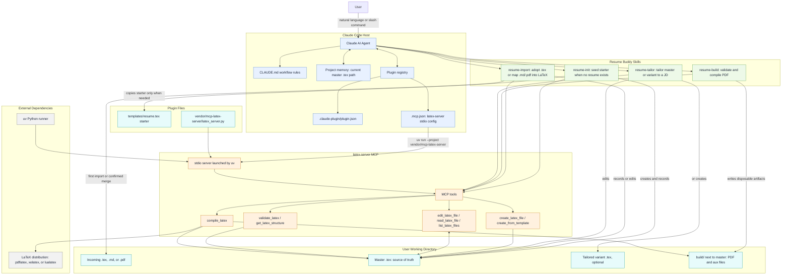

# Resume Buddy Architecture

This diagram reflects the current plugin model described by `CLAUDE.md`, the
skill files, `.claude-plugin/plugin.json`, and `.mcp.json`.

```mermaid
flowchart TB
    user[User]

    subgraph host[Claude Code Host]
        agent[Claude AI Agent]
        rules[CLAUDE.md workflow rules]
        memory[Project memory: current master .tex path]
        registry[Plugin registry]
        manifest[.claude-plugin/plugin.json]
        mcpConfig[.mcp.json: latex-server stdio config]
    end

    subgraph skills[Resume Buddy Skills]
        init[resume-init: seed starter when no resume exists]
        import[resume-import: adopt .tex or map .md/.pdf into LaTeX]
        build[resume-build: validate and compile PDF]
        tailor[resume-tailor: tailor master or variant to a JD]
    end

    subgraph mcp[latex-server MCP]
        stdio[stdio server launched by uv]
        tools[MCP tools]
        create[create_latex_file / create_from_template]
        edit[edit_latex_file / read_latex_file / list_latex_files]
        validate[validate_latex / get_latex_structure]
        compile[compile_latex]
    end

    subgraph pluginFiles[Plugin Files]
        template[templates/resume.tex starter]
        vendor[vendor/mcp-latex-server/latex_server.py]
    end

    subgraph workspace[User Working Directory]
        incoming[Incoming .tex, .md, or .pdf]
        master[Master .tex: source of truth]
        variant[Tailored variant .tex, optional]
        output[build/ next to master: PDF and aux files]
    end

    subgraph external[External Dependencies]
        uv[uv Python runner]
        latex[LaTeX distribution: pdflatex, xelatex, or lualatex]
    end

    user -->|natural language or slash command| agent
    agent --> rules
    agent <--> memory
    registry --> manifest
    registry --> mcpConfig
    agent <--> registry

    agent --> init
    agent --> import
    agent --> build
    agent --> tailor

    init -->|copies starter only when needed| template
    init -->|creates and records| master
    import -->|first import or confirmed merge| incoming
    import -->|records or edits| master
    tailor -->|edits| master
    tailor -->|or creates| variant
    build -->|writes disposable artifacts| output

    init --> tools
    import --> tools
    build --> tools
    tailor --> tools

    mcpConfig -->|uv run --project vendor/mcp-latex-server| stdio
    uv --> stdio
    vendor --> stdio
    stdio --> tools
    tools --> create
    tools --> edit
    tools --> validate
    tools --> compile

    create --> master
    edit <--> master
    validate --> master
    compile --> master
    compile --> latex
    compile --> output

    classDef host fill:#e8f1ff,stroke:#4d7ec9,color:#172033
    classDef skill fill:#edf9e8,stroke:#5da34d,color:#172033
    classDef mcp fill:#fff1df,stroke:#c87819,color:#172033
    classDef file fill:#e7fbfb,stroke:#239b9b,color:#172033
    classDef external fill:#f2f2f2,stroke:#7f7f7f,color:#172033

    class agent,rules,memory,registry,manifest,mcpConfig host
    class init,import,build,tailor skill
    class stdio,tools,create,edit,validate,compile mcp
    class template,vendor,incoming,master,variant,output file
    class uv,latex external
```
